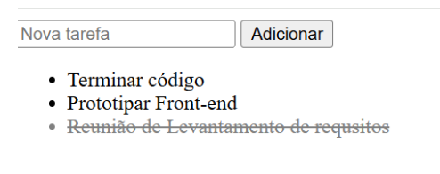

# 🚀 JavaScript Mastery: Laboratório de Práticas

Bem-vindo ao repositório de **Exemplos Práticos de JavaScript**. Este espaço foi projetado para servir como um guia de referência dinâmica, reunindo conceitos fundamentais e avançados aplicados em projetos reais. Se você está consolidando sua lógica ou explorando novas APIs do navegador, aqui você encontrará o código necessário para dar vida às suas interfaces. 💻📱

---

## 💡 O que é JavaScript?

O JavaScript (JS) é a peça fundamental que transforma documentos estáticos em experiências interativas. Através dele, dominamos o **DOM (Document Object Model)**, gerenciamos fluxos assíncronos e criamos aplicações que respondem em tempo real às ações do usuário, elevando o nível de interatividade e performance na web.

---

## 📂 Organização do Aprendizado

Os exemplos estão segmentados por competências técnicas, facilitando a navegação e o estudo dirigido para a turma de Desenvolvimento de Sistemas:

### 🎨 Interface e Experiência (UI/UX)
* **Manipulação do DOM**: Controle total sobre elementos HTML.
* **Estilização Dinâmica**: Alteração de propriedades CSS via JS.
* **Menus & Navegação**: Implementação de menus hambúrguer e componentes responsivos.
* **Componentes Visuais**: Carrosséis de imagens e animações fluidas.

### ⚙️ Lógica e Persistência
* **Web Storage**: Persistência de dados no navegador com `localStorage`.
* **Listas Dinâmicas**: Operações fundamentais com To-Do Lists interativas.
* **Validação de Formulários**: Tratamento e segurança de dados em tempo real.

### 🌐 Comunicação e Fluxo
* **Requisições Assíncronas**: Consumo de APIs utilizando a `Fetch API`.
* **Modern JS**: Implementação de `Async/Await` e tratamento robusto de erros com `Try/Catch`.

---

## 👨‍💻 Como Explorar este Repositório

Siga os passos abaixo para rodar os projetos em sua máquina local:

1.  **Clone este laboratório:**
    ```bash
    git clone [https://github.com/senaisesisa2hds/javascript-exemplos.git](https://github.com/senaisesisa2hds/javascript-exemplos.git)
    ```

2.  **Acesse a pasta do projeto:**
    ```bash
    cd javascript-exemplos
    ```

3.  **Execução:**
    Abra qualquer arquivo `.html` diretamente no navegador. 

> 💡 **Dica de mestre:** No VS Code, utilize a extensão **Live Server** para visualizar as alterações em tempo real sem precisar atualizar a página manualmente.

---

## 📸 Preview dos Projetos

| To-Do List Dinâmica | Carrossel Interativo |
| :---: | :---: |
|  |  |
| *Gerenciamento de estados.* | *Lógica de navegação.* |

---

## 📜 Licença

Este projeto está sob a licença **MIT**. Sinta-se à vontade para estudar, modificar e compartilhar o conhecimento!

## 📬 Contato e Suporte

Dúvidas sobre o código ou sugestões de novos exemplos? Entre em contato:

* 📧 **E-mail:** [exemplo@gmail.com](mailto:exemplo@gmail.com)
* 🏢 **Instituição:** SENAI/SESI

---
<p align="center">
  <b>Desenvolvido com ☕ e código por SENAI/SESI 2IH-DS | 2026</b>
</p>